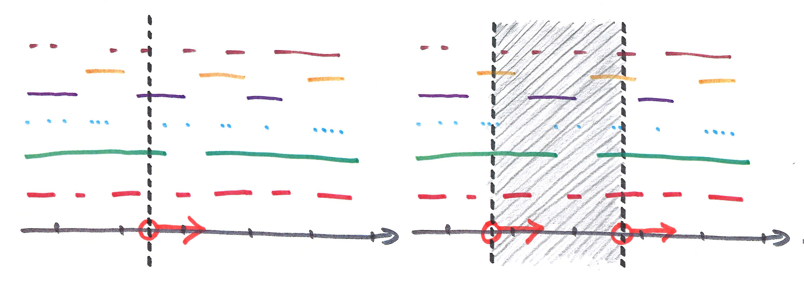
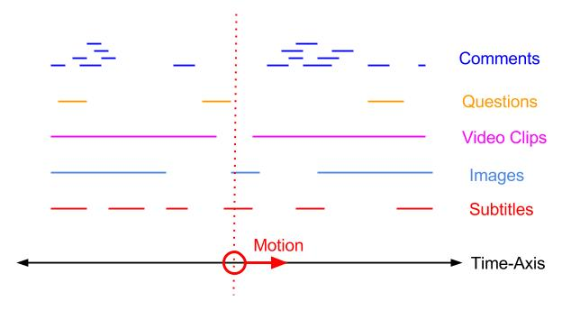

## Abstract

> *Sequencer* and *IntervalSequencer* are generic tools for *timed execution* of *timed data*.

*Sequencing* broadly refers to the process of translating a timed script into timed execution. Sequencing is not a new concept. Frameworks for timed media or timed presentation are always built around some form of sequencing logic. However, implementations are typically internal, custom to specific media formats, and tightly integrated with predefined UI components. Furthermore, media clocks and media controls (e.g. play/pause) are also tightly integrated, making it hard to synchronize frameworks with other timed media.

To address these issues, the Sequencer is designed with two main goals.

**1) Isolate sequencing logic from data and UI.**
The Sequencer is pure JavaScript and fully encapsulates sequencing logic, without introducing any dependencies to specific data formats or UI elements. By virtue of being data-agnostic and UI-agnostic, the Sequencer makes common timing logic available for any Web application and any purpose.

**2) Use TimingObject as timing source.**
The [TimingObject](http://webtiming.github.io/timingobject) is a simple concept encapsulating both timing and timing controls. It is proposed as a unifying approach for temporal interoperability in the Web, and prepared for standardization by the [W3C Multi-device Timing Community Group](https://www.w3.org/community/webtiming/). In short, by sharing a single timing object as timing source, independent Sequencers may be precisely coordinated in time. Crucially, this is also true in the distributed scenario, as timing objects support synchronization with online timing objects. So, by using the timing object as timing source, the Sequencer is ready to support precise sequencing in both single-device as well as multi-device scenarios.

## Toc

- [introduction](#introduction)
- [music box analogy](#musicbox)
- [design goals](#designgoals)
- [related work](#relatedwork) 
- [importance](#importance)
- [future work](#futurework)


<a name="introduction"></a>
## Introduction

> Sequencers work on timed cues and emit *enter* and *exit* events at the correct time when data becomes *active* or *inactive*, according to some timing source. 

The core idea is that programmers express temporal validity of objects by associating them with Intervals. For instance, a subtitle may be associated with [12.1, 17.44], thus indicating validity in reference to some media timeline. (Singular points are intervals too, with length 0). Furthermore, in order to decouple sequencers from a specific data model, intervals are not associated directly with data objects, but indirectly through some unique identifier. For instance, programmers may use identifiers from an application specific data model as keys into the sequencer.

> Sequencers manage a collection of *(key,interval)* associations, where *intervals* define the temporal validity of *keys*. 
> A (key,interval) association is also known as a *cue*.

Sequencers in the timinsrc library use the timing object as timing source. The main function of sequencers is to emit *enter* and *exit* events at the correct time, as cues become *active* or *inactive*, always consistent with the the timing object. Sequencers also maintains a list of *active cues*, always consistent with history of event callbacks.

**Sequencer** and **IntervalSequencer** differ in how the define *active* and *inactive* state for cues. 

Sequencers are similar to [TrackElements](http://www.html5rocks.com/en/tutorials/track/basics/).

> Sequencers in timingsrc library are data agnostic and can therefore be used with any application-specific data model, provided only that application data can be associated with unique keys, and that temporal aspects can be expressed in terms of intervals or singular points.


<a name="timeddata"></a>
## Timed Data 


By linear data we simply mean data that is somehow organised according to an axis, e.g., a point on the axis, or an interval. For instance, a subtitle may be structured as follows, where properties *start* and *end* indicate when the object should be active, in reference to the time-axis.

```javascript
var obj = {
	text : "Hello!",
	type : "subtitle",
	start : 24.3,
	end : 28.7
}
```

However, to avoid dependency on a particular data model, we separate data from timing information, and instead link them together through a unique key. 
This way, sequencers work exclusively on cues, i.e. (key, interval) pairs, and remain agnostic with respect to a particular data format. 
Intervals define when keys are active (in reference to some axis). Emitted enter and exit events include keys which may then be used to fetch the appropriate objects from the data model.

```javascript
var cue = {
	key : "unique key",
	interval : new Interval(24.3,28.7)
};
datamodel["unique key"] = {text: "Hello!", type: "subtitle"};
```

<a name="twotypes"></a>
## Sequencer and IntervalSequencer


The sketches below illustrate two  we may define when a cue becomes active and inactive.




In the first sketch a vertical line is associated with the current position of the timing object.

The The vertical line is the current position of the timing object, defining at any time the “questions”, “movie clips”, “images”, “subtitles” and  “comments” that are valid at the current moment in time. Currently only a single “subtitle” is valid. As the timing object continues forward, this subtitle will shortly cease to be valid, and need to be removed as motion enters a segment with no subtitle.



how a linear media presentation is defined by movement through linear data.


With the _Sequencer_ an interval on the timeline is active whenever it covers the moving position of the timing object. The _IntervalSequencer_ uses two timingobjects to define a moving interval. An interval on the timeline is active whenever it is fully or partially covered by the moving interval of the _IntervalSequencer_. 